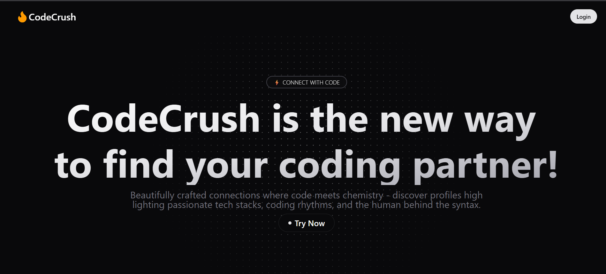

# CodeCrush 🔥
[Live Demo](https://code--crush.vercel.app/)

Code Crush is a dating/social media platform designed to connect developers. 
Create an account, set up your profile, and start swiping to send interest or ignore requests—once accepted, 
enjoy real-time chat with your connections.


## Features 

- Match by Tech Stack
  - Find your perfect pair programmer with tech stack compatibility that clicks.
- Share Projects
  -  Showcase your GitHub projects, blogs, and side hustles that reveal your coding soul.
- Real-time Geek Chat
  - Dive into debates about tabs vs. spaces or bond over bug fixes in our specialized chat where tech talk flows freely.

## TechStack
- ReactJs + Typescript
- Redux ToolKit
- TailwindCSS V5
- ShadCn ui + Magic ui
- Socket.io 

## Backend code available [here](https://github.com/iamtanishqsethi/code-crush-backend)

## Installation 
1. Clone the repository:
   ```bash
   git clone https://github.com/iamtanishqsethi/code-crush-frontend
   ```
2. Navigate to the project directory:
   ```bash
   cd code-crush-frontend
   ```
3. Install dependencies:
   ```bash
   npm i 
   ```
4. Run the application:
   ```bash
   npm run dev
   ```
The app will be available at ```http://localhost:5173/```


